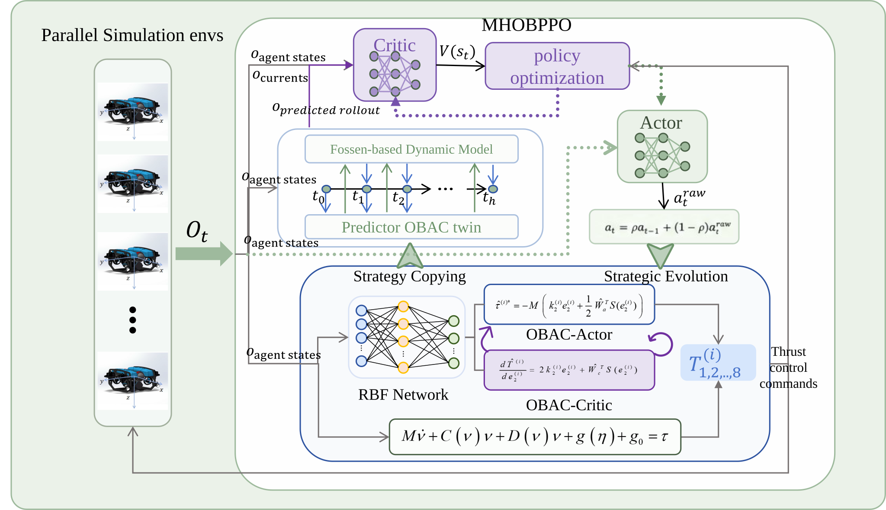

<div align="center">


# BlueROV Swim
[](https://isaac-sim.github.io/IsaacLab/main/index.html)
[](https://docs.python.org/3/whatsnew/3.10.html)
[](https://docs.isaacsim.omniverse.nvidia.com/4.5.0/)
[](LICENSE)

</div>
BlueROV Swim is an Isaac Lab simulation package for BlueROV Heavy control research. It includes robot assets, DirectRL environments, thruster and hydrodynamic models, PPO configurations, controller playback tools, and dynamics tests.

## Features

- An end-to-end environment that maps observations to eight normalized thruster commands.
- An OBPPO environment for learning controller parameters around the OBAC controller.
- BlueROV Heavy assets and configurable physics, sensors, pool, and seabed scenes.
- PWM/thrust conversion, thruster allocation and dynamics models.
- Fossen hydrodynamic and rigid-body inertia models.
- RSL-RL PPO runner configurations and controller evaluation scripts.

## Requirements

- Python 3.10
- Isaac Sim 4.5.0
- Isaac Lab 2.3.0
- The PyTorch, Gymnasium, and RSL-RL dependencies supplied by Isaac Lab

Install and verify Isaac Sim and Isaac Lab first. Run commands from the repository's parent directory or add that directory to `PYTHONPATH` so Python can import this package:

```bash
export PYTHONPATH="$(dirname "$PWD"):$PYTHONPATH"
```

## Registered environments

Gymnasium environments are registered in [__init__.py](__init__.py):

| Environment ID | Implementation | Action space | PPO configuration |
| --- | --- | --- | --- |
| `Isaac-BlueROV-Direct-v0` | `bluerov_pwm_env.py` | Eight normalized thruster commands | `BlueROVPWMPPORunnerCfg` |
| `Isaac-BlueROV-Direct-v2` | `bluerov_obppo_env.py` | OBPPO controller-parameter actions | `BlueROVObppoRunnerCfg` |

## Repository layout

```text
.
├── assets/              # BlueROV and scene assets
├── agents/              # RSL-RL PPO runner configurations
├── config/              # PWM and OBPPO environment parameters
├── controller/          # Base, OBAC, backstepping, and predictor code
├── data/                # Thruster curves and sampled centers
├── hydrodynamics/       # Fossen and inertia models
├── scripts/             # Playback, evaluation, and test scripts
├── thrusterModels/      # Thruster allocation, dynamics, and conversion
├── utils/               # Sampling, fitting, and shared utilities
├── bluerov_pwm_env.py   # End-to-end thruster environment
└── bluerov_obppo_env.py # OBPPO environment
```

## Common commands

Run these commands in an Isaac Lab environment. Add supported flags such as `--headless`, `--device`, or `--num_envs` when needed.

```bash
# Play an OBPPO policy checkpoint
python scripts/play_obppo_controller.py

# Run the OBAC controller directly in the v2 environment
python scripts/play_obac_controller.py

# Evaluate position and attitude holding
python scripts/play_poshold.py \
  --task Isaac-BlueROV-Direct-v0 \
  --play_checkpoint /path/to/model.pt

# Validate the thruster and dynamics models
python scripts/test_thruster_configure.py
python scripts/test_thruster_force.py
python scripts/test_thruster_model.py
python scripts/test_fossen_sim.py
```

Default checkpoint names and run directories are configured in each playback script. For example, `play_obppo_controller.py` looks for `logs/obppo_controller/model_3999.pt` by default.

## Configuration

- `config/pwm_config.py`: end-to-end environment, randomization, and reward settings.
- `config/obppo_config.py`: OBPPO environment, predictor rollout, observation, and reward settings.
- `agents/rsl_rl_ppo_cfg.py`: PPO network, optimizer, logging, and checkpoint settings.
- `data/`: sampled controller centers and thruster data used by the models.

## Development notes

1. Register new Gymnasium environment IDs in `__init__.py`.
2. Keep environment configuration, controller scripts, and PPO configuration synchronized when observation, action, or state dimensions change.
3. After changing thruster or hydrodynamic code, run `scripts/test_thruster_*.py` and `scripts/test_fossen_sim.py` for a quick check.
4. Playback scripts generally read checkpoints from `logs/`; training outputs and exported JIT/ONNX models are written under `logs/` or `runs/`.

## License

This project is distributed under the MIT License. See [LICENSE](LICENSE).
