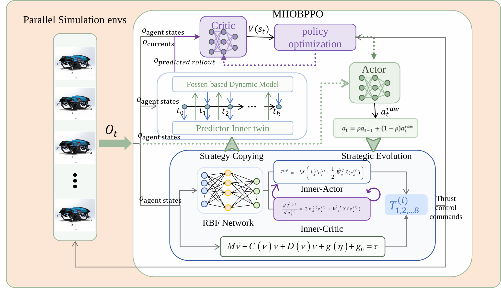

<div align="center">


# Mhobppo: Underwater vehicle pose tracking under disturbance using hierarchical reinforcement learning
[](https://isaac-sim.github.io/IsaacLab/main/index.html)
[](https://docs.python.org/3/whatsnew/3.10.html)
[](https://docs.isaacsim.omniverse.nvidia.com/4.5.0/)
[](LICENSE)

</div>
Mhobppo is an Isaac Lab simulation package for AUV rl-based control research. It includes robot assets, DirectRL environments, thruster and hydrodynamic models, controller playback tools, and dynamics tests.

## Features

- An end-to-end environment that maps observations to eight normalized thruster commands.
- An Mhobppo environment for learning controller parameters around the OBAC controller.
- BlueROV Heavy assets and configurable physics, sensors, pool, and seabed scenes.
- PWM/thrust conversion, thruster allocation and dynamics models.
- Fossen hydrodynamic and rigid-body inertia models.

## Requirements

- Python 3.10
- Isaac Sim 4.5.0
- Isaac Lab 2.3.0
- The PyTorch, Gymnasium, and RSL-RL dependencies supplied by Isaac Lab

Install and verify Isaac Sim and Isaac Lab first. Run commands from the repository's parent directory or add that directory to `PYTHONPATH` so Python can import this package:

```bash
export PYTHONPATH="$(dirname "$PWD"):$PYTHONPATH"
```

## Registered environments

Gymnasium environments are registered in [__init__.py](__init__.py):

| Environment ID | Implementation | Action space | PPO configuration |
| --- | --- | --- | --- |
| `Isaac-BlueROV-Direct-v0` | `bluerov_pwm_env.py` | Eight normalized thruster commands | `BlueROVPWMPPORunnerCfg` |
| `Isaac-BlueROV-Direct-v2` | `bluerov_obppo_env.py` | OBPPO controller-parameter actions | `BlueROVObppoRunnerCfg` |


## Quick Start
```bash
git clone https://github.com/Airporal/Mhobppo_training.git
cd <IsaacLabPath>/source/isaaclab_tasks/isaaclab_tasks/direct/
ln -s <MhobppoTrainingPath> blueROV-direct-env
```
And then, you can start to train mhobppo or pwmppo or your own rl controller.
+ For pwmppo:
```bash

cd <IsaacLabPath>
python scripts/reinforcement_learning/rsl_rl/train.py --task Isaac-BlueROV-Direct-v0 --num_envs 4096 --headless
```
+ For Mhobppo:
```bash
gedit <MhobppoTrainingPath>/config/mhobppo_config.py
# change mode from 2 to 1
cd <IsaacLabPath>
python scripts/reinforcement_learning/rsl_rl/train.py --task Isaac-BlueROV-Direct-v1 --num_envs 4096 --headless
```

The trained model will be placed in directory IsaacLabPath/logs/rsl_rl.
Then, you can open the tensorboard to view the training process.
```bash
tensorboard --logdir logs/rsl_rl
```
